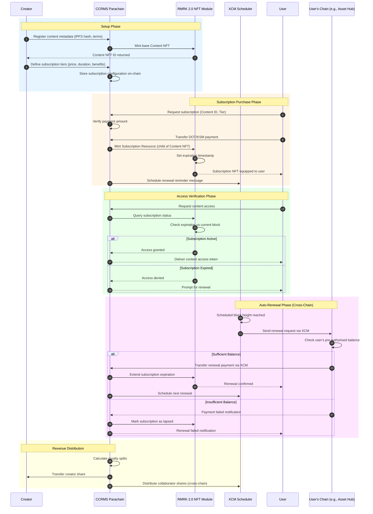
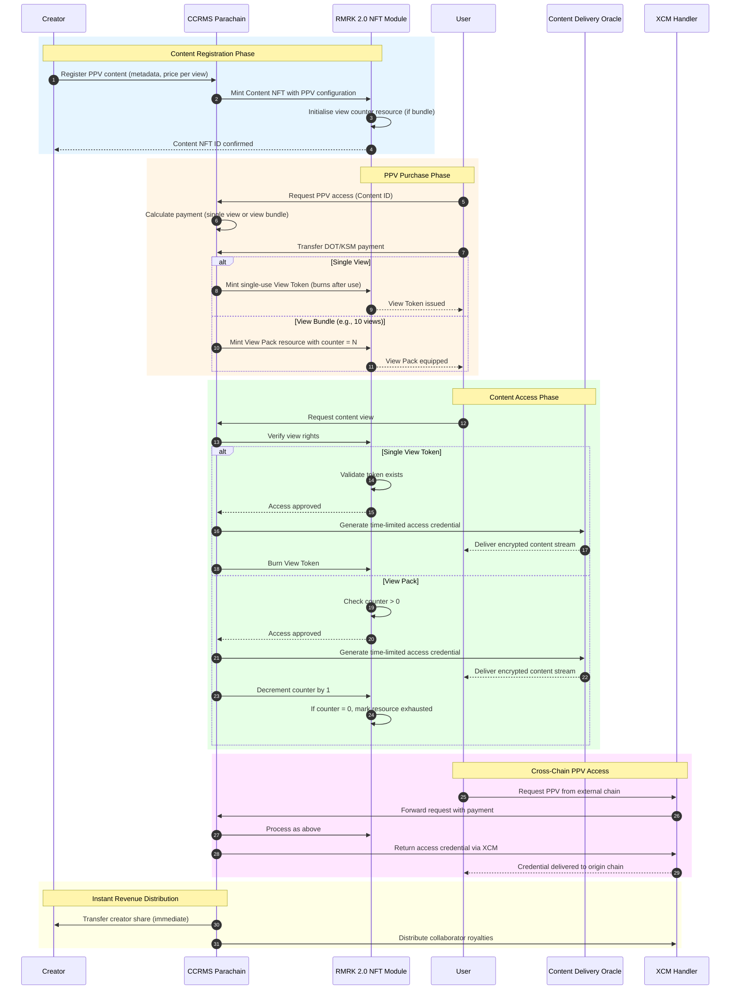
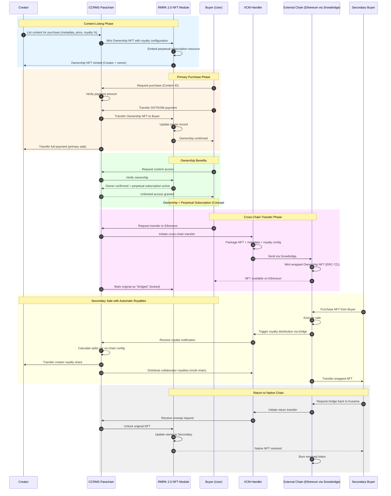
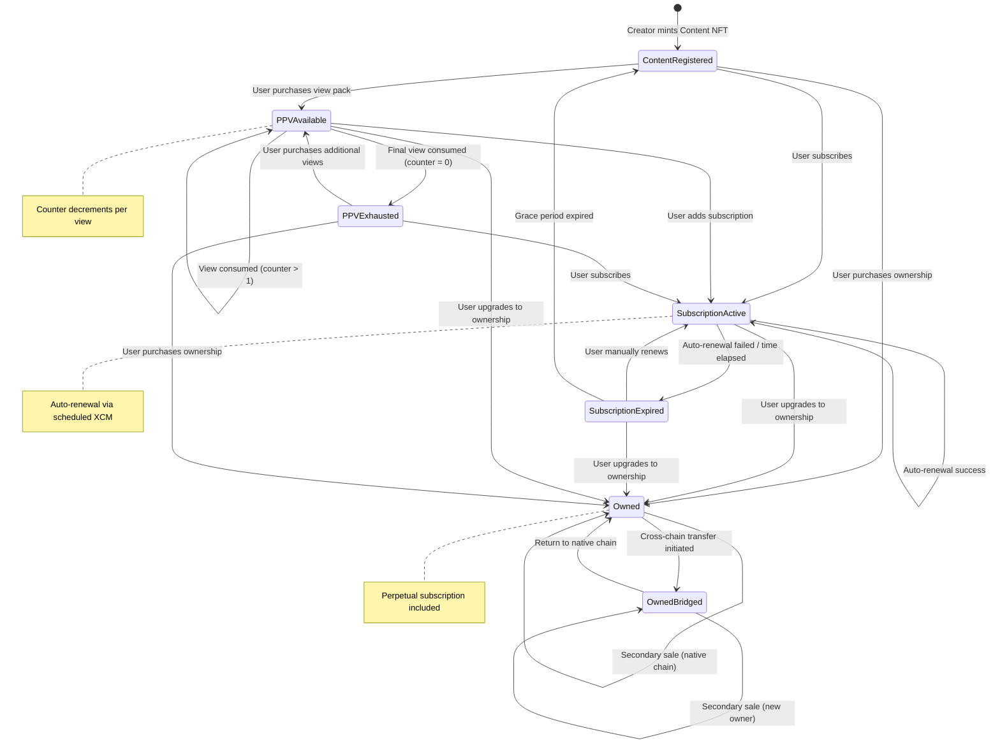

## Conceptual Diagrams for Key Flows
### Cross-Chain Content Rights Management Service

This document provides conceptual diagrams and comprehensive textual descriptions for the three fundamental monetisation flows within the CCRMS framework: Subscription, Pay-Per-View (PPV), and Purchase. Each flow is depicted in sequence diagrams and accompanied by a narrative.

---

## 1. Subscription Flow

### 1.1 Sequence Diagram

### 1.2 Textual Description

#### Subscription Flow Overview

The subscription process allows creators to provide time-constrained, recurring access to content via a modular NFT-based rights management system. This process uses RMRK 2.0's nested resource architecture and scheduled XCM messaging to enable native cross-chain subscription renewals without relying on centralized intermediaries.

#### Setup Phase

The subscription process begins when the creator registers content on the CCRMS parachain. Content metadata, including IPFS content hashes and licensing terms, is submitted to the parachain, which then initiates minting a base Content NFT via the RMRK 2.0 module. This NFT serves as the primary object to which subscription resources will be linked. The creator then defines subscription tiers, specifying parameters such as price (in DOT or KSM), duration (measured in block height or Unix timestamp), and associated benefits. These configurations are stored on-chain, ensuring transparent, verifiable subscription management terms.

#### Subscription Purchase Phase

When a user elects to subscribe, they submit a subscription request specifying the desired content and tier. The CCRMS smart contract verifies the payment amount against the stored tier configuration. Upon successful payment transfer, the RMRK 2.0 module mints a Subscription Resource as a child of the Content NFT, which is then assigned to the user's account. This resource contains an expiration timestamp calculated from the current block height plus the subscription duration. Concurrently, the XCM Scheduler receives instructions to dispatch a renewal reminder at a specified block height in the future.

#### Access Verification Phase

Content access requests initiate an on-chain verification process. The CCRMS parachain consults the RMRK 2.0 module to ascertain the subscription status linked to the requesting user. The module compares the subscription's expiration timestamp with the current block height. If the subscription is still valid, an access token is produced and provided to the user, permitting content retrieval. If the subscription has expired, the user is prompted to renew their subscription.

#### Auto-Renewal Phase

The auto-renewal mechanism constitutes a significant innovation, utilizing scheduled XCM to facilitate cross-chain recurring payments. When the predetermined block height is reached, the XCM Scheduler transmits a renewal request to the user's preferred chain (e.g., Asset Hub or an external network via bridge). The destination chain verifies the user's pre-authorized balance and, if it is adequate, initiates a cross-chain payment transfer back to the CCRMS parachain. Upon receipt, the RMRK module extends the subscription expiration, and a new renewal is scheduled. If the balance is insufficient, the subscription is marked as lapsed, and the user is notified.

#### Revenue Distribution

Following each subscription payment, the CCRMS parachain calculates royalty distributions according to on-chain configuration. The creator's share is transferred directly, whilst collaborator shares may be distributed cross-chain via XCM to recipients on other parachains or external entities networks.

---

## 2. Pay-Per-View (PPV) Flow

### 2.1 Sequence Diagram

### 2.2 Textual Description

#### Pay-Per-View Flow Overview

The Pay-Per-View (PPV) mechanism facilitates a transactional, consumption-based method of content access. In contrast to subscriptions, PPV provides access for a single viewing or a limited number of views, rendering it appropriate for premium content, live events, or micro-transaction monetisation models. The system is engineered to accommodate sub-cent transaction costs, thereby enabling genuine micro-payments based on per-minute or per-segment usage billing.

#### Content Registration Phase

Creators register PPV content by submitting metadata and pricing configuration to the CCRMS parachain. The RMRK 2.0 module mints a Content NFT with embedded PPV parameters, including the price per view and optional bundle configurations (e.g., "10 views for X DOT"). For bundled offerings, a view counter resource is initialised as a child of the Content NFT.

#### PPV Purchase Phase

Users requesting PPV access initiate a payment calculation based on their selection (single view or bundle). Upon completion of the payment transfer, the system responds accordingly to the purchase type:

- **Single View:** A single-use View Token is minted as a consumable NFT resource. This token provides exactly one viewing instance and is subsequently burned upon use.
- **View Bundle:** A View Pack resource is minted with an integer counter initialized to the purchased quantity (e.g., 10). Each viewing instance decrements the counter until it is exhausted.

This design embodies the thesis concept of "Pay-Per-View as a Counter, Not a New Token" (High-Level System Concept #3), in which views decrement an integer within an existing rights object rather than requiring the minting of new tokens for each view transaction.

#### Content Access Phase

When the user requests content access, the CCRMS parachain consults the RMRK module to validate viewing rights. For single-use tokens, confirming existence is sufficient; for View Packs, the counter must be greater than zero. Upon successful verification, the parachain instructs a Content Delivery Oracle to generate a time-limited access credential, thereby allowing the user to stream or download the encrypted content. After viewing, the View Token is either burned or the counter is decremented. When a View Pack's counter reaches zero, the resource is marked as exhausted but remains retained for audit purposes.

#### Cross-Chain PPV Access

Users on external chains may access PPV content via XCM. The request, accompanied by payment, is forwarded to the CCRMS parachain, processed identically to local requests, and the access credential is returned via XCM to the user's origin chain. This enables content consumption from any XCM-compatible network without requiring asset bridging.

#### Revenue Distribution

PPV payments initiate prompt revenue disbursement. The creator's portion is allocated instantly with each transaction, facilitating real-time earnings instead of aggregated payouts. Collaborator royalties are disseminated through XCM to recipients across the ecosystem.

---

## 3. Purchase (Permanent Ownership) Flow

### 3.1 Sequence Diagram

### 3.2 Textual Description

#### Purchase Flow Overview

The purchase process enables the permanent transfer of content rights, constituting the most comprehensive access level within the CCRMS framework. This process operationalizes the thesis that "Ownership = Subscription Upgrade" (High-Level System Concept #5), whereby acquiring content automatically grants lifelong subscription privileges. Additionally, the process supports cross-chain portability and secondary-market transactions with automatic enforcement of royalty payments.

#### Content Listing Phase

Creators compile content for purchase by submitting metadata, pricing details, and royalty configurations to the CCRMS parachain. The RMRK 2.0 module facilitates the minting of an Ownership NFT with integrated royalty percentages for secondary sales. Importantly, a perpetual subscription resource is automatically embedded in the Ownership NFT, ensuring that ownership inherently grants unlimited access to content without the need for a separate subscription management system.

#### Primary Purchase Phase

When a purchaser initiates a purchase request, the CCRMS parachain validates the payment amount against the listed price. Upon successful transfer of funds, the Ownership NFT is transferred from the creator to the purchaser, with the ownership record being updated within the RMRK module. In the case of primary sales, the creator receives the entire payment amount, less nominal network fees, thereby maximizing the creator's revenue retention.

#### Ownership Benefits

Owners are granted continuous, unrestricted access to the content. Whenever an owner requests access, the CCRMS parachain verifies the ownership status along with the embedded perpetual subscription resource. Verification affirms both ownership and an active subscription status, thereby providing access without any expiration checks or renewal obligations. This integration eradicates the necessity for separate subscription management for owned content.

#### Cross-Chain Transfer Phase

A distinctive characteristic of the CCRMS framework is its capability to facilitate ownership transfers across different blockchain networks. Owners may initiate requests to transfer assets to external chains, such as Ethereum via Snowbridge. The XCM Handler consolidates the NFT along with its comprehensive metadata and royalty configuration, transmitting it to the designated chain. Subsequently, the external chain mints a wrapped representation, such as ERC-721 on Ethereum, which maintains all associated rights and royalty obligations. The original NFT on the CCRMS parachain is subsequently marked as "bridged" and locked to prevent unauthorized manipulation duplication.

#### Secondary Sale with Automatic Royalties

When a wrapped NFT is sold on a secondary marketplace, such as OpenSea on the Ethereum network, the transaction initiates an automatic royalty distribution process. The external blockchain notifies the CCRMS parachain through the bridge mechanism, which then calculates the appropriate royalty divisions in accordance with the on-chain configuration. The creator's royalty portion is subsequently transferred, and shares allocated to collaborators are distributed via XCM to recipients across multiple chains. This process embodies "Automatic Royalty Propagation Across Chains" (High-Level System Concept #6), thereby ensuring that creators receive royalties irrespective of the chain hosting the secondary sale.

#### Return to Native Chain

Owners on external chains may elect to return their NFT to the native Kusama/Polkadot ecosystem. Upon initiating the return transfer, the wrapped token is burned on the external chain, and the original NFT on the CCRMS parachain is unlocked with the new owner record updated. This bidirectional bridging ensures that content rights remain portable whilst maintaining a single source of truth.

---

## 4. Unified Rights Token State Diagram

### 4.1 State Diagram

### 4.2 Textual Description

#### Unified Rights Token States

The concept of the Unified Rights Token (High-Level System Concept #1) facilitates the representation of multiple access states through a single on-chain object simultaneously. The above state diagram delineates the potential states and transitions applicable to a content rights token within the CCRMS framework.

**Content Registered:** Represents the initial state following creator registration. The Content NFT is present; however, no user has acquired any access rights.

**Subscription Active:** Indicates that a user holds an active, time-limited subscription. The token encompasses an expiration timestamp and a scheduled XCM renewal. Successful auto-renewal sustains this state; failure of renewal or the elapsing of time results in a transition to Subscription Expired.

**Subscription Expired:** Signifies that the subscription has lapsed. Users may manually renew to return to Subscription Active, upgrade to ownership (transitioning to Owned), or allow the grace period to expire, which reverts the state to Content Registered, making it available for new users.

**PPV Available:** Denotes that a user possesses a View Pack with remaining views (counter > 0). Each view consumption decreases the counter. Users may add subscriptions or upgrade to ownership while retaining remaining views.

**PPV Exhausted:** The View Pack counter has reached zero. The token is retained for audit purposes. Users may purchase additional views, subscribe, or upgrade to ownership.

**Owned:** The user holds permanent ownership, inclusive of a perpetual subscription resource. Owners may transfer the NFT on the native chain to a new owner or initiate a cross-chain transfer.

**Owned (Bridged):** The NFT has been transferred to an external chain. The native NFT is locked. Secondary sales on the external chain update ownership while triggering royalty distribution. The NFT may be returned to the native chain.

This unified state model enables seamless transitions between monetization models and supports bundling benefits (e.g., "purchase includes perpetual subscription").

---

## 5. Summary of Key Design Patterns

| Pattern | Implementation | Thesis Concept Addressed |
|---------|----------------|--------------------------|
| **Composable NFT Architecture** | RMRK 2.0 nested resources; subscription/PPV as children of Content NFT | #1: Unified Rights Token |
| **Counter-Based PPV** | Integer counter within View Pack resource; decrement per view | #3: PPV as Counter, Not Token |
| **Scheduled Cross-Chain Messaging** | XCM scheduler triggers renewal at specified block height | #2: Recurring Cross-Chain Subscription |
| **Metadata-Carrying Transfers** | XCM messages include rights metadata, royalty config, expiration | #4: Metadata-Carrying Messages |
| **Ownership-Subscription Unification** | Ownership NFT embeds perpetual subscription resource | #5: Ownership = Subscription Upgrade |
| **Cross-Chain Royalty Propagation** | Bridge notifications trigger on-chain royalty calculation and XCM distribution | #6: Automatic Royalty Propagation |
| **Bidirectional Bridging** | Lock/mint on transfer out; burn/unlock on return | Interoperability requirement |

---

