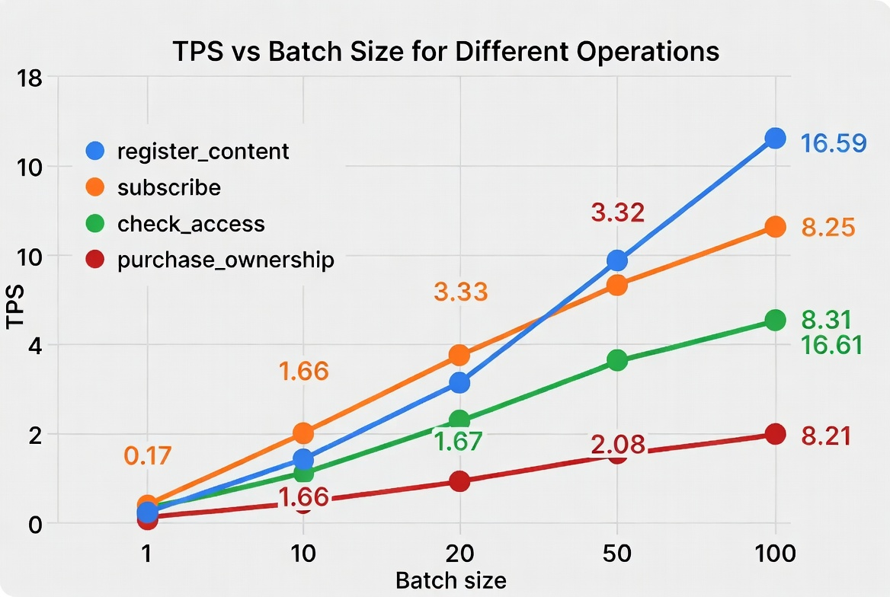
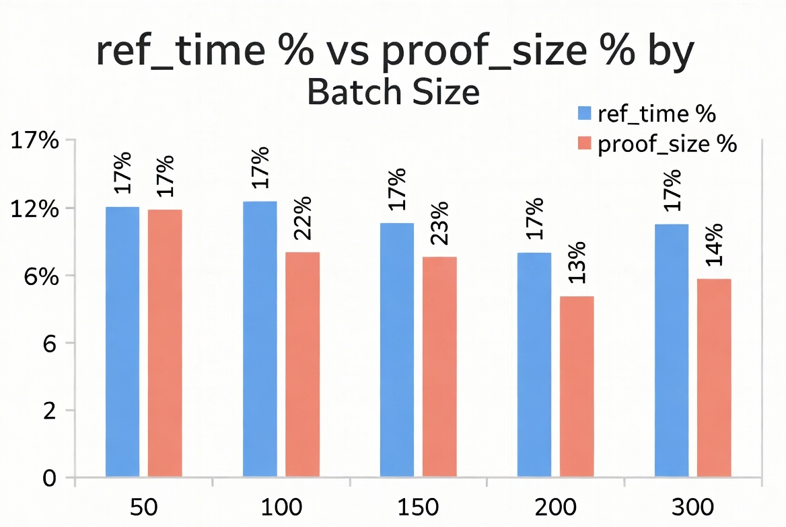
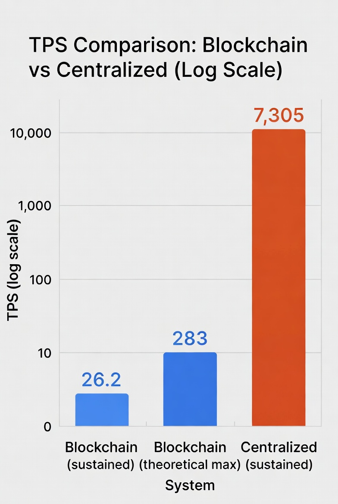
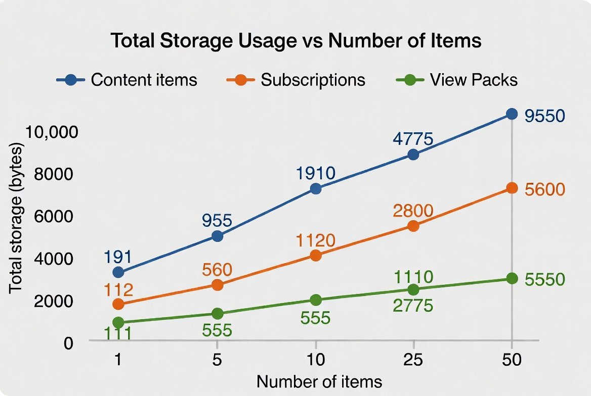
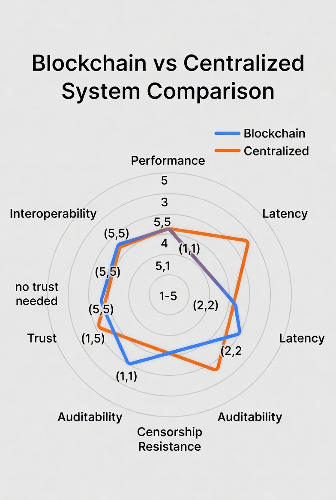

# Charts, Graphs, and Tables for Thesis

Specifications for visual elements to include in the Results and Evaluation chapters. Data is from the consolidated evaluation dataset. Charts can be generated using any tool (Excel, Google Sheets, matplotlib, Mermaid, LaTeX pgfplots).

---

## Figure 7.1: Throughput vs Batch Size (Blockchain)

**Type:** Line chart
**X-axis:** Batch size (1, 10, 20, 50, 100)
**Y-axis:** TPS
**Lines:** register_content, subscribe, check_access, purchase_ownership

| Batch | register_content | subscribe | check_access | purchase_ownership |
|-------|-----------------|-----------|-------------|-------------------|
| 1 | 0.17 | 0.17 | 0.17 | 0.17 |
| 10 | 1.67 | 1.66 | 1.67 | 1.66 |
| 20 | 3.32 | 3.33 | 3.33 | 3.32 |
| 50 | 8.30 | 8.25 | 8.31 | 2.08 |
| 100 | 16.59 | 8.31* | 16.61 | 8.21* |

*MaxChildrenPerNft limit. Annotate on chart.

**Key insight:** register_content and check_access scale linearly; subscribe/ownership plateaus at 50 (configurable limit).

---

## Figure 7.2: Block Weight Utilisation

**Type:** Grouped bar chart
**X-axis:** Batch size (50, 100, 150, 200, 300)
**Y-axis:** Percentage (%)
**Bars:** ref_time %, proof_size %

| Batch | ref_time % | proof_size % |
|-------|------------|-------------|
| 50 | 2.15 | 0.63 |
| 100 | 4.30 | 0.94 |
| 150 | 6.45 | 1.24 |
| 200 | 15.05 | 1.95 |
| 300 | 12.90 | 2.18 |

**Key insight:** Even at 300 txs, the block is <13% full. Add a dashed line at 75% showing the "normal" weight limit.

---

## Figure 7.3: Blockchain vs Centralized TPS (Logarithmic Scale)

**Type:** Bar chart (log scale Y-axis)
**X-axis:** System
**Y-axis:** TPS (log scale)
**Bars:** Blockchain sustained (27), Blockchain theoretical (283), Centralized sustained (7,305)

| System | TPS |
|--------|-----|
| Blockchain (sustained) | 26.2 |
| Blockchain (theoretical max) | 283 |
| Centralized (sustained) | 7,305 |

**Key insight:** Use a log scale to show the 270× gap without making the blockchain bar invisible.

---

## Figure 7.4: Latency Comparison (Logarithmic Scale)

**Type:** Horizontal bar chart (log scale X-axis)
**Y-axis:** Operation
**X-axis:** Latency in ms (log scale)
**Bars:** Blockchain, Centralized (side by side)

| Operation | Blockchain (ms) | Centralized (ms) |
|-----------|----------------|-------------------|
| register_content | 5,985 | 0.14 |
| subscribe | 6,013 | 0.50 |
| check_access | 5,985 | 0.05 |
| XCM cross-chain | 18,000-32,000 | N/A |

---

## Figure 7.5: Storage Growth

**Type:** Line chart
**X-axis:** Number of items
**Y-axis:** Total storage (bytes)
**Lines:** Content items, Subscriptions, View packs

| Items Added | Content (bytes) | Subscriptions (bytes) | View Packs (bytes) |
|-------------|----------------|----------------------|-------------------|
| 1 | 191 | 112 | 111 |
| 5 | 955 | 560 | 555 |
| 10 | 1,910 | 1,120 | 1,110 |
| 25 | 4,775 | 2,800 | 2,775 |
| 50 | 9,550 | 5,600 | 5,550 |

**Key insight:** Perfectly linear — O(n) growth with no overhead.

---

## Figure 7.6: XCM Cross-Chain Latency Distribution

**Type:** Box plot or bar with error bars
**X-axis:** Operation
**Y-axis:** Block delta

| Operation | Run 1 | Run 2 | Run 3 | Avg |
|-----------|-------|-------|-------|-----|
| xcm_subscribe | 2 | 4 | 5 | 3.7 |
| xcm_purchase_views | 7 | 4 | 5 | 5.3 |
| xcm_purchase_ownership | 7 | 4 | 5 | 5.3 |

---

## Figure 7.7: Resource Utilisation Under Load

**Type:** Dual-axis time series
**X-axis:** Time (seconds)
**Left Y-axis:** Transaction pool depth
**Right Y-axis:** Block height

Three phases annotated: Idle (0-30s), Sustained Load (30-90s), Cooldown (90-120s)

**Data points:** From resource-monitor-results.json samples.

---

## Figure 7.8: Stress Test Comparison

**Type:** Side-by-side summary cards or table

| Metric | Blockchain | Centralized |
|--------|-----------|-------------|
| Duration | 180s | 180s |
| Total operations | 4,713 | 1,315,000 |
| Sustained TPS | 26.2 | 7,305 |
| Success rate | 22% | 100% |
| Latency p50 | ~6,000 ms | 15 ms |
| Latency p99 | ~6,050 ms | 27 ms |
| Breaking point | RPC limit (1024) | None reached |

---

## Figure 7.9: KPI Dashboard

**Type:** Traffic light table (green/amber/red)

| KPI | Target | Result | Status |
|-----|--------|--------|--------|
| Throughput | >10 TPS | 26.2 TPS | 🟢 |
| Latency | <12s | ~6s | 🟢 |
| XCM latency | <10 blocks | 3-5 blocks | 🟢 |
| Block utilisation | <75% | 12.9% | 🟢 |
| Storage | <500 bytes | 191 bytes | 🟢 |
| Uptime | >85% | 90% | 🟢 |
| MTTR | <60s | 15-20s | 🟢 |
| State persistence | 100% | 100% | 🟢 |
| Security | 0 Critical/High | 0C/0H/0 unresolved M | 🟢 |
| Test coverage | >80% | 82% (14/17) | 🟢 |
| Decentralisation | Documented | 270× ratio | 🟢 |

---

## Figure 7.10: Qualitative Trade-off Radar

**Type:** Radar/spider chart
**Axes:** Performance, Latency, Trust, Censorship Resistance, Auditability, Interoperability
**Lines:** Blockchain (high on trust axes), Centralized (high on performance axes)

| Axis | Blockchain (1-5) | Centralized (1-5) |
|------|------------------|-------------------|
| Performance | 1 | 5 |
| Latency | 1 | 5 |
| Trust (no trust needed) | 5 | 1 |
| Censorship Resistance | 5 | 1 |
| Auditability | 5 | 2 |
| Interoperability | 5 | 2 |

**Key insight:** The two systems are mirror images — blockchain excels where centralized fails and vice versa.

